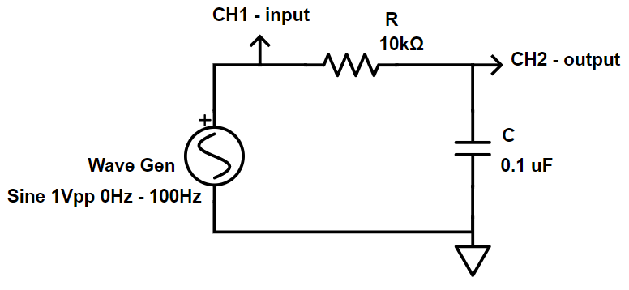
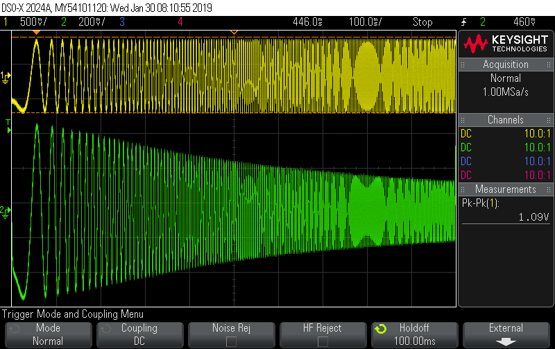
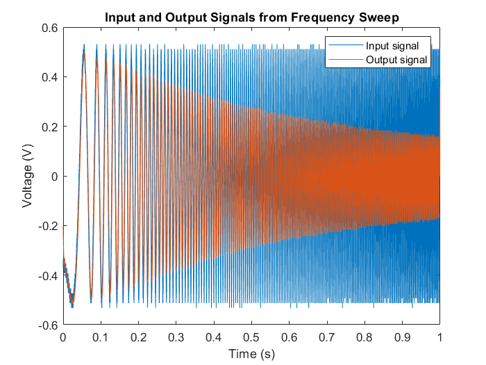
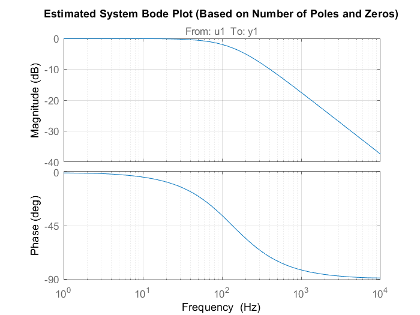
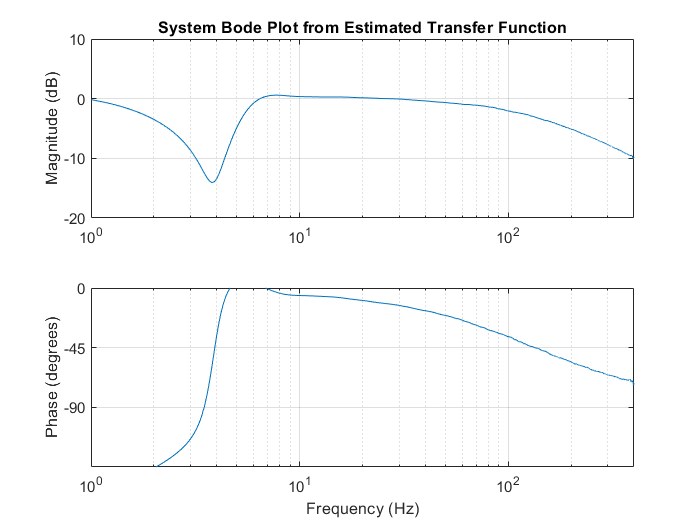
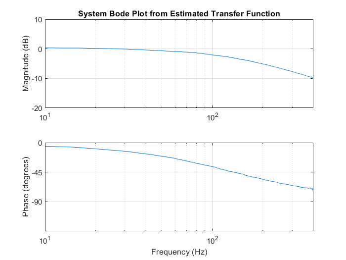

_This document serves as a guide to help you set up frequency modulation on the
DSO-X 2024A oscilloscopes, as well as, capturing signal data and using it to
generate estimated Bode Plots more rapidly the performing the sweep and taking
frequency, gain and phase data manually._

**_David E Olumese, dolumese@g.hmc.edu, 01/29/19_**

---

# Automated Bode Plot Generation using Frequency Modulation
## How to FM on DSO-X
1. Connect `Gen Out` and `CH1` (input) to the input of the circuit under test
2. Connect `CH2` (output) to the output of the circuit under test
3. Press `Wave Gen`; choose the input waveform and amplitude. Set the frequency to be the center of the sweep range
4. Select `Settings` then select `Modulation`
5. Create a sawtooth frequency modulation:
  1. `Type`     &rarr; FM
  2. `Waveform` &rarr; Ramp
  3. `FM Freq`  &rarr; _1Hz (sweep frequency)_
  4. `FM Dev`   &rarr; _Half of the sweep range (such that sweep range = [Freq - FM Freq, Freq + FM Freq])_
  5. `Symmetry` &rarr; 100%
6. Press `Trigger`; choose `CH2` (output) as the `Source`. Move the trigger just below the crest of the output signal; such that the oscilloscope will only trigger once every sweep
7. Modify the screen scaling to display one (or the desired number of) sweep fully as possible
8. Press `Mode/Coupling`; set `Mode` to normal and `Holdoff` to be able half a time division on the screen (play around with this, such that multiple triggers do not occur during the same sweep)
9. Save the data
  1. Capture the signal using `Run/Stop` or `Single`
  2. Pull in USB drive
  3. Press `Save/Recall` then select `Save`
  4. Press `Format` and select CSV
  5. Press `Press to Save`
10. Transfer the data file to a computer, and run the `genBodePlot.m` MATLAB script to generate estimated bode plots for your analysis (change the variable at the top of the script as necessary)


<div style="page-break-after: always;"></div>
## Example - Frequency Response of RC Circuit
This example to show performing a 0Hz to 400Hz frequency sweep on a simple RC low pass filter.



The exact RC values are 9.97k&ohm; and 114nF, so the expected cutoff frequency is 140Hz.

Given that I want to sweep from 0Hz to 400Hz, I set `Frequency` &rarr; 200Hz and `FM Dev` &rarr; 200Hz. I wanted to display a single sweep on the screen, so scaled the screen to display at 200mV, for `CH1`, 500mV, for `CH2`, and 100ms divisions.

I set `Holdoff` &rarr; 100ms and then captured and saved the signal onto a USB stick.



I, then, run `genBodePlot.m` with the following variables:
```MATLAB
% data file parameters
fname = './Data/rcCircuit.csv';
fStartRow = 3;
fStartCol = 0;

% estimated number of system poles & zeros
np = 1;
nz = 0;

% maximum frequency in sweep
FRange_Hz = 1:0.1:400;      % [Hz]
Fmax_Hz   = FRange_Hz(end); % [Hz]
Fmax      = Fmax_Hz*(2*pi); % [rad/s]

% bode plot figure bounds
mindB = -20;
maxdB = 10;
minDeg = -135;
maxDeg = 0;
```
And the following plots were generated.



Knowing that the circuit was a RC low pass filter, one pole was specified to create this bode plot. _The corner frequency of the system based off this bode plot is 133Hz._


This bode plot is generated without any number of the system's properties (poles/zeros). It sweeps from 1Hz to 400Hz. The estimation performs poorly at lower frequencies. _The corner frequency of the system based off this bode plot is 133Hz._


This bode plot is identical to the previous one, but excludes the regions of poor estimation. It sweeps from 10Hz to 400Hz.


<div style="page-break-after: always;"></div>
---

### _genBodePlot.m_
```MATLAB
% genBodePlot.m
% David E Olumese (dolumese@g.hmc.edu) | 28th Jan 2019
% E151/E153 Course Development

%% variables
% data file parameters
fname = './Data/rcCircuit.csv';
fStartRow = 3;
fStartCol = 0;

% estimated number of system poles & zeros
np = 1;
nz = 0;

% maximum frequency in sweep
FRange_Hz = 1:0.1:400;      % [Hz]
Fmax_Hz   = FRange_Hz(end); % [Hz]
Fmax      = Fmax_Hz*(2*pi); % [rad/s]

% bode plot figure bounds
mindB = -20;
maxdB = 10;
minDeg = -135;
maxDeg = 0;

%% Pull data from the file
M = csvread(fname, fStartRow, fStartCol);
t    = M(:,1);
inV  = M(:,2);
outV = M(:,3);

t = t - t(1); % adjust time to start from zero

Ts = t(2);  % [s] Sampling period
Fs = 1/Ts;  % [Hz] Sampling frequency
windw = []; % windowing function

%% Plot data
figure(1)
plot(t, inV, t, outV);
legend('Input signal', 'Output signal')
xlabel('Time (s)')
ylabel('Voltage (V)')
title('Input and Output Signals from Frequency Sweep')

%% Make bode plot with estimated poles & zeros
% generate an estimated system
data = iddata(outV, inV, Ts);
sys = tfest(data, np, nz);

% plot the bode plot
figure(2)
H = bodeplot(sys);
setoptions(H, 'FreqUnits', 'Hz');
title('Estimated System Bode Plot (Based on Number of Poles and Zeros)')
grid on

%% Make bode plot using transfer function estimation
[txy, ft] = tfestimate(inV, outV, windw, [], FRange_Hz, Fs); % generate tf estimate

% determine system parameters
A  = abs(txy);           A_dB = mag2db(A);
Ph = unwrap(angle(txy)); Ph_deg = 180/pi*Ph;
w  = 2*pi*ft;

% plot bode (include only useful information [F0, Fmax])
figure(3);
subplot(2, 1, 1)
semilogx(ft, A_dB);
axis([0 Fmax_Hz mindB maxdB])
title('System Bode Plot from Estimated Transfer Function')
ylabel('Magnitude (dB)')
grid on

subplot(2, 1, 2)
semilogx(ft, Ph_deg);
set(gca, 'YTick', [-180 -90 -45 0 45 90 180])
axis([0 Fmax_Hz minDeg maxDeg])
xlabel('Frequency (Hz)')
ylabel('Phase (degrees)')
grid on
```

---

### References
 - https://community.keysight.com/community/keysight-blogs/oscilloscopes/blog/2016/09/01/how-to-create-bode-plots-on-an-oscilloscope | A guide on creating frequency sweeps using FM modulation with a sawtooth function
 - https://www.youtube.com/watch?v=uMH2hGvqhlE | A guide on creating frequency sweeps using a dedicated function generator with a sweep function
 - https://www.mathworks.com/products/sysid.html | System Identification Toolbox; required for the `tfest` function
 - https://www.mathworks.com/help/ident/ref/tfest.html | Used to generate an estimated transfer function based off input data, output data and system poles and zeros
 - https://www.mathworks.com/help/signal/ref/tfestimate.html | a transfer function estimate, `txy`, given an input signal, `x`, and an output signal, `y`. Used to determine an estimate of system magnitude and phase without the need for knowing the number of poles and zeros
 - https://www.mathworks.com/matlabcentral/answers/231761-obtaining-a-transfer-function-from-tfestimate | example use of `tfestimate` to generate bode plots
